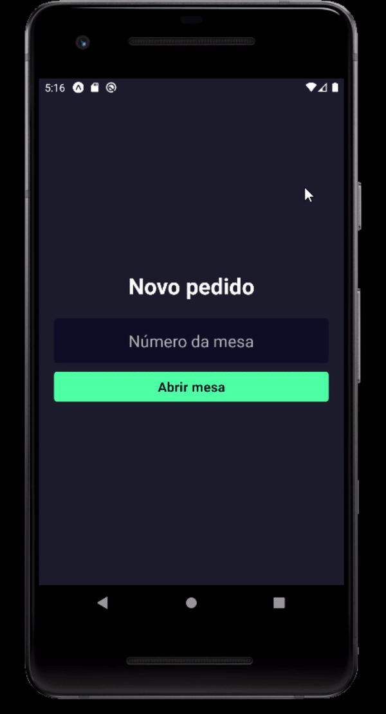

# App Pizzaria

# Sobre o projeto

 Este projeto é um aplicativo que o garçom pode anotar os pedidos da mesa e enviar para o sistema web com os produtos e o preço total do pedido!

 O intuito deste projeto é aprimorar meus conhecimentos em React Native com o dev Matheus Fraga do canal:

 <https://www.youtube.com/c/Sujeitoprogramador>


## Layout Mobile 

<div style="display: flex; flex-wrap: wrap;">

</div>


# Tecnologias utilizadas 

- React Native
- TypeScript

# Pré requisitos

 - Node.js e aplicativo Expo Go instalado.
 - Backend rodando.
  
```bash
 # Baixar backend
 git clone https://github.com/leowingss/backend-pizzaria.git

 # Instalar dependências e executar o projeto
 yarn install 
 yarn dev
```

# Como rodar o projeto

```bash 
git clone https://github.com/leowingss/app-pizzaria.git

# Entrar na pasta
cd app-pizzaria

# Instalar dependências
npm install

# Executar o projeto
expo start 

# Abrir projeto
Apontar a câmera do seu celular no qrcode.

``` 